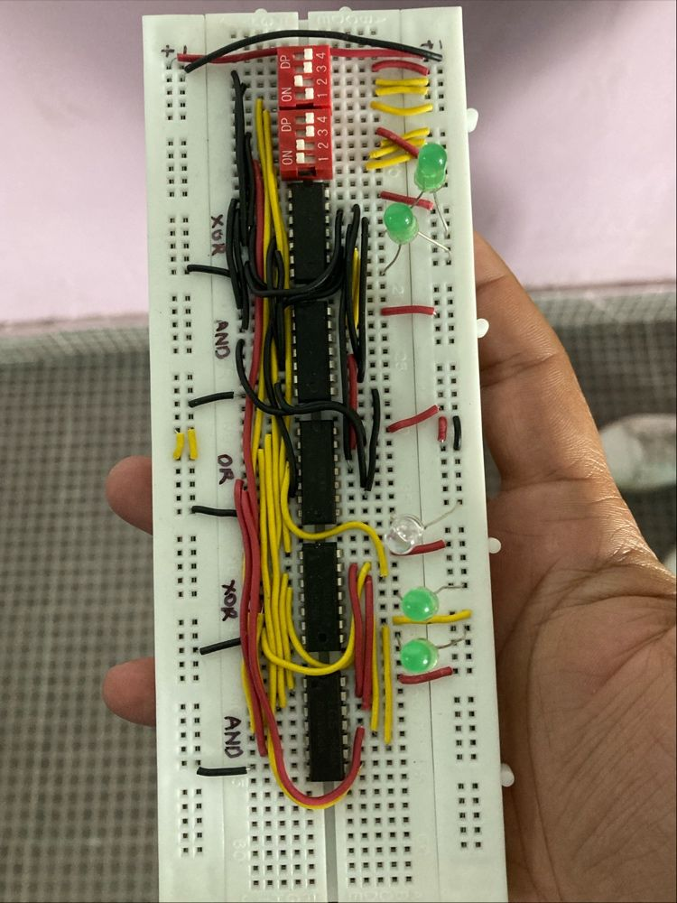

# ⚙️ 4-Bit Binary Adder using Logic Gates

## 🧠 Overview
Hi everyone! 👋  
Recently, I’ve built a **4-bit binary adder** using **full adders implemented with basic logic gates**.  

This project demonstrates how binary addition works at the hardware level using **XOR, AND, and OR gates** — the core building blocks of digital electronics.

The adder takes **two 4-bit binary inputs** through DIP switches and displays the **sum and carry outputs** using LEDs.  
It’s a simple yet powerful way to visualize how computers perform arithmetic operations at the logic gate level.

---

## 🔩 Components Used
| Component | Quantity | Description |
|------------|-----------|-------------|
| 7486 IC | 2 | Quad XOR Gate (used for Sum bits) |
| 7432 IC | 2 | Quad OR Gate (used for Carry generation) |
| 7408 IC | 1 | Quad AND Gate (used for Carry propagation) |
| DIP Switch (4-bit) | 2 | For binary inputs (A and B) |
| LEDs | 5 | For displaying Sum (4 bits) and Carry |
| Resistors | 5 | 220Ω or 330Ω (current limiting for LEDs) |
| Breadboard | 1 | Circuit prototyping |
| Jumper Wires | As needed | For connections |
| 5V Power Supply | 1 | Logic-level power source |

---

## 🔍 Circuit Description
Each full adder is formed using basic gates as follows:

**Sum = A ⊕ B ⊕ Cin**  
**Carry = (A ⋅ B) + (Cin ⋅ (A ⊕ B))**

By cascading four full adders, we obtain a **4-bit binary adder**.  
The DIP switches act as inputs (A3–A0 and B3–B0), and LEDs display the output sum bits (S3–S0) along with the final carry bit (Cout).

---

## 🧾 Truth Table (Example for 1-bit Full Adder)

| A | B | Cin | Sum | Cout |
|:-:|:-:|:-:|:-:|:-:|
| 0 | 0 | 0 | 0 | 0 |
| 0 | 0 | 1 | 1 | 0 |
| 0 | 1 | 0 | 1 | 0 |
| 0 | 1 | 1 | 0 | 1 |
| 1 | 0 | 0 | 1 | 0 |
| 1 | 0 | 1 | 0 | 1 |
| 1 | 1 | 0 | 0 | 1 |
| 1 | 1 | 1 | 1 | 1 |

---

## 💡 Working Principle
1. Set input bits **A3–A0** and **B3–B0** using the DIP switches.  
2. Observe the LED outputs — they represent the **binary sum and carry**.  
3. Changing switch combinations dynamically updates the results, demonstrating live binary addition.

---

## 📸 Project Image
Here’s the actual circuit implementation on a breadboard:

---

## 🧰 Key Learning Outcomes
- Understanding **binary addition** and **carry propagation**  
- Practical use of **logic gate ICs (74xx series)**  
- Cascading multiple **full adders** to create multi-bit arithmetic circuits  
- Breadboard circuit wiring and debugging  

---

## 🚀 Future Improvements
- Add a **7-segment display** for showing decimal equivalents of inputs and outputs  
- Implement **subtraction mode** using 2’s complement  
- Design a **PCB version** for permanent setup  
- Interface with a **microcontroller (Arduino/ESP32)** for automated input control and output display  

---

## 👨‍💻 Author
**Mohammad Sharique Arshad**  
B.Tech in Electronics and Communication Engineering (ECE)  
Lovely Professional University  

📫 [GitHub Profile](https://github.com/YourUsername)  
💬 “Building circuits that bring logic to life.”

---

## 🧩 Tags
`#DigitalElectronics` `#LogicGates` `#4BitAdder` `#ElectronicsProject` `#ECE` `#HardwareLearning`
